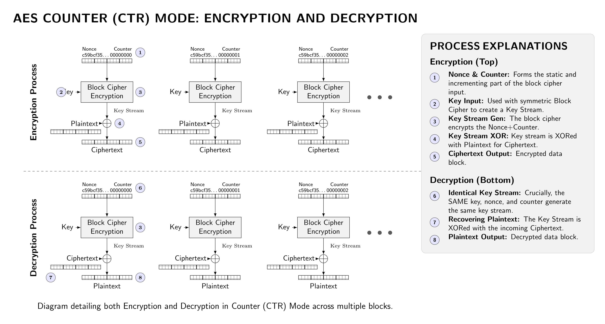
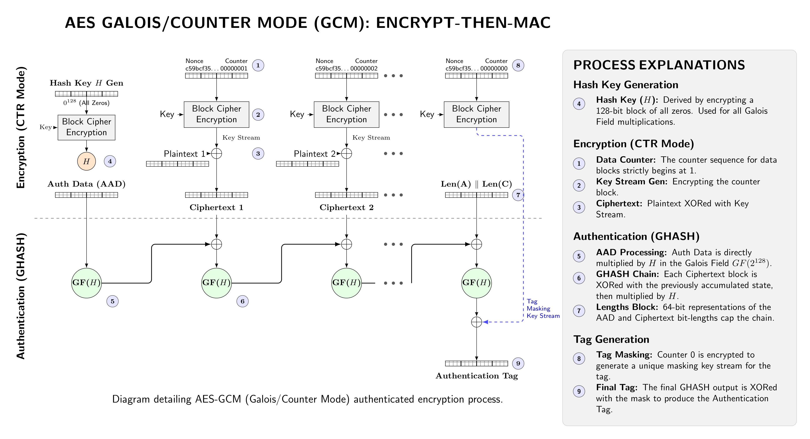
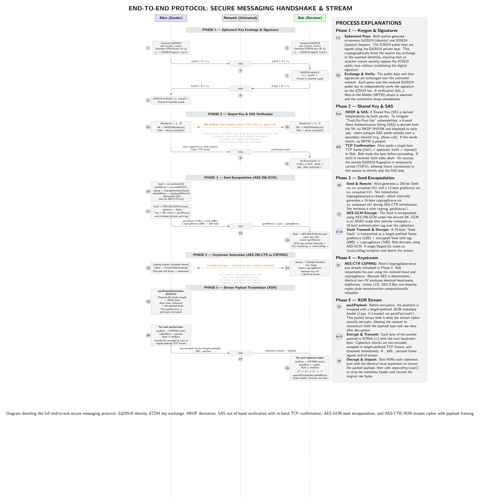

# Project Workflow & Algorithm Documentation: Authenticated Secure Stream Protocol


## Before We Start: What Are We Actually Building?

Imagine Alice wants to send the word `"Hello"` to Bob over the internet. Simple enough, right? The problem is that the internet is not a private telephone line between two people. It is more like shouting across a crowded room. Every router, ISP, and potentially every curious actor between Alice and Bob can see the raw bytes flying through the wire.

So the goal is clear: Alice needs to scramble `"Hello"` into unreadable noise before sending it, and Bob needs a way to unscramble it back on the other side. What's *not* clear is how to make that happen securely when literally anyone can watch the conversation. That problem turns out to be surprisingly deep, and solving it requires layering several algorithms on top of each other, each one patching a specific hole the previous one leaves open.

This document is split into two halves. **Part 1** works *backwards* from the goal — it starts with what we want and walks backwards through every obstacle that makes it hard, introducing each algorithm as a direct answer to the specific problem it solves. This way, no algorithm appears out of nowhere. **Part 2** then replays the whole thing *forward* in time, tracing the exact journey of the word `"Hello"` from Alice's keyboard to Bob's screen, step by step.

---

## Security Layer Reference Map

Before diving into the details, here is a single reference you can return to at any point. Every algorithm in this system operates at a specific phase, protects a specific piece of data, and provides a specific guarantee. Nothing overlaps, and nothing is redundant.

```
PHASE                │ ALGORITHM          │ PROTECTS                  │ GUARANTEE
─────────────────────┼────────────────────┼───────────────────────────┼──────────────────────────
Pre-session (once)   │ Ed25519 Key Gen    │ Identity                  │ Permanent identity anchor
─────────────────────┼────────────────────┼───────────────────────────┼──────────────────────────
Handshake (once)     │ X25519 (ECDH)      │ The shared secret         │ Key agreement without
                     │                    │                           │ transmitting the secret
                     ├────────────────────┼───────────────────────────┼──────────────────────────
                     │ Ed25519 Signatures │ The X25519 public values  │ Protects against network
                     │                    │                           │ tampering during transit
                     ├────────────────────┼───────────────────────────┼──────────────────────────
                     │ HKDF               │ The raw shared secret     │ Converts it into a
                     │                    │                           │ proper 32-byte AES key
                     ├────────────────────┼───────────────────────────┼──────────────────────────
                     │ SAS (Short Auth    │ The shared secret         │ Out-of-band MITM
                     │ String)            │                           │ detection mechanism
─────────────────────┼────────────────────┼───────────────────────────┼──────────────────────────
Seed exchange (once) │ AES-256-GCM        │ The Seed value itself     │ Confidentiality & Integrity
                     │                    │                           │ — encrypts and authenticates
─────────────────────┼────────────────────┼───────────────────────────┼──────────────────────────
Streaming (repeated) │ AES-256-CTR        │ Keystream synchronisation │ Both sides produce the
                     │ (CSPRNG)           │                           │ same bytes independently
                     ├────────────────────┼───────────────────────────┼──────────────────────────
                     │ XOR                │ Each message byte         │ Encrypts and decrypts
                     │                    │                           │ using the keystream
```

---

## Part 1: The Problem-Solving Architecture

### 1. The Ultimate Target: Fast, Secure Data Streaming

**The Goal:** Scramble and transmit `"Hello"` (or any stream of data) over the internet so that only the intended recipient can read it, and do it fast enough that it doesn't bottleneck the system.

**The Solution — XOR Cipher:**

The scrambling operation at the heart of this system is the humble XOR gate (`^`), and it turns out to be almost perfect for streaming data.

XOR is perfectly reversible. Apply a random byte to scramble a plaintext byte, and you get ciphertext. Apply the exact same random byte to that ciphertext, and you recover the original. The same operation encrypts and decrypts. 

XOR is secure *if and only if* the random bytes are entirely unpredictable. If the random byte is truly random and unknown to the eavesdropper, the ciphertext is statistically indistinguishable from random noise. 

The catch, however, is the phrase "truly random." That's where the next problem begins.

---

### 2. Obstacle: Predictability — Where Do the Random Bytes Come From?

**The Problem:**

If Bob needs to decrypt Alice's message, he must produce the exact same sequence of random bytes that Alice used to encrypt it. True randomness, by definition, has no pattern to synchronise. You also cannot send the random bytes over the network, because they effectively *are* the key.

**The Solution — AES-CTR as a CSPRNG:**

Instead of true randomness, we use a **Cryptographically Secure Pseudorandom Number Generator (CSPRNG)**. Both sides use the AES block cipher in Counter (CTR) mode.

<p align="center">
  
</p>

**How Synchronization Works:**
To produce identical keystreams, Alice and Bob do not need to send the entire infinite stream of random bytes to each other. They only need to share a single starting point. 
1. Alice uses her operating system's true random number generator (`os.urandom(32)`) to create a perfectly random 256-bit (32-byte) **Seed** (this acts as the AES key).
2. She instantiates `CsprngGenerator(seedBytes)`. The constructor internally generates a highly secure 16-byte random **Nonce** via `os.urandom(16)` to act as the initialization vector for AES-CTR. Even though the Seed is fully ephemeral and unique per session, generating a random nonce is standard cryptographic "Defense in Depth" to definitively prevent the catastrophic "Two-Time Pad" vulnerability if a key is ever reused.
3. She securely transmits both this Seed and the public Nonce to Bob (we'll explain how in the next section).
4. Once Bob receives them, both Alice and Bob load the Seed as the key and the Nonce as the initialization vector into their local AES-CTR engines.
5. They begin encrypting a sequence of null bytes.


Because AES is a deterministic algorithm, giving it the exact same 32-byte key (`Seed`) and the exact same 16-byte nonce (`csprngNonce`) guarantees that both Alice and Bob's machines will produce the exact same sequence of pseudo-random bytes in perfect lockstep, forever.

**Why not use a simple mathematical generator?**
Older or simpler systems often used formulas like a Linear Congruential Generator (LCG) to generate pseudo-random numbers. While fine for video games, an LCG is catastrophic for cryptography. Because an LCG relies on basic linear algebra, an attacker who guesses just a few words of your plaintext can use that to reveal a small chunk of the keystream. Using basic algebra, they can then easily solve the linear equations to find the generator's internal state. Once they have the internal state, they can predict every future byte and calculate every past byte, completely breaking the encryption.

AES-CTR solves this because it relies on highly complex, non-linear mathematical trapdoors (specifically, S-Box substitutions). It is impossible to predict the next byte or work backwards to reconstruct the internal state, even if an attacker manages to observe millions of bytes of the keystream. 

So instead of synchronising an infinite stream of random bytes, Alice and Bob only need to synchronise a single 32-byte Seed.

---

### 3. Obstacle: Syncing the Seed Securely

**The Problem:**

Alice has generated a 32-byte random Seed. Bob needs that exact Seed to synchronise his CSPRNG. If Alice sends it over the network in plaintext, an eavesdropper intercepts it, spins up their own AES-CTR generator, and decrypts the entire conversation.

**The Solution — AES-256-GCM:**

We need to encrypt the Seed before transmission. To do this, Alice uses the Advanced Encryption Standard (AES) in GCM (Galois/Counter Mode).

<p align="center">
  
</p>

The Advanced Encryption Standard (AES) in GCM (Galois/Counter Mode) is the industry-standard symmetric cipher. It takes a plaintext input and a 32-byte key, and produces ciphertext that is computationally infeasible to break without that key. AES-256 specifically uses a 256-bit (32-byte) key, which gives 2²⁵⁶ possible keys — a number so astronomically large that brute-forcing it is beyond any realistic computation.

AES-GCM is an **Authenticated Encryption with Associated Data (AEAD)** cipher. This means it solves two problems simultaneously:
1. **Confidentiality**: It encrypts the Seed so an eavesdropper sees only noise.
2. **Integrity**: GCM inherently computes a 16-byte authentication tag (using polynomial arithmetic over a Galois field) over the ciphertext. 

If a malicious actor (a Man-in-the-Middle) attempts to flip a single bit of the encrypted Seed in transit, Bob's AES-GCM decryption will mathematically fail and raise an `InvalidTag` exception. Bob immediately knows the data was tampered with and discards it. **No secondary HMAC wrapper is needed** because GCM provides structural integrity guarantees natively.

So Alice encrypts the Seed with AES-GCM and sends it. But wait — AES requires a key. Where does the 32-byte key for *this* AES-GCM encryption come from?

---

### 4. Obstacle: The Chicken-and-Egg Key Problem

**The Problem:**

To transmit the Seed securely, Alice needs an AES key. But she can't transmit the AES key securely without already having a secure channel.

**The Solution — X25519 (Elliptic Curve Diffie-Hellman):**

To establish a shared secret without transmitting it, Alice and Bob use **X25519**, a fast and highly secure implementation of Elliptic Curve Diffie-Hellman (ECDH) operating on **Curve25519**.

**How the Trapdoor Works:**
Standard DH relies on modular exponentiation. Elliptic Curve Cryptography (ECC) relies on the geometry of curves defined by `y² = x³ + ax + b`. On this curve, you can define "addition" of two points. If you add a point `G` to itself `k` times, you get a new point `P`. This is called scalar multiplication: `P = k * G`.

The trapdoor (the one-way mathematical function) here is the **Elliptic Curve Discrete Logarithm Problem (ECDLP)**:
- **Easy**: Given a point `G` and a massive integer `k`, it is extremely fast to compute `P = k * G`.
- **Hard (The Trapdoor)**: Given `G` and the resulting point `P`, it is computationally infeasible to work backwards to find `k`. There is no known algorithm (short of a sufficiently large quantum computer) that can reverse this operation efficiently.

**The Exchange:**
1. Alice picks a random private key `a` (her scalar) and computes her public key `A = a * G`.
2. Bob picks a random private key `b` and computes his public key `B = b * G`.
3. They exchange `A` and `B` publicly.
4. Alice computes: `SharedSecret = a * B`
5. Bob computes: `SharedSecret = b * A`

Because of the associative property of scalar multiplication, `a * (b * G)` is identical to `b * (a * G)`. Both Alice and Bob end up at the exact same point on the elliptic curve. An eavesdropper who sees `A` and `B` cannot find `a` or `b` (due to the ECDLP trapdoor) and therefore cannot compute the shared point.

A 256-bit X25519 key provides security equivalent to roughly a 3072-bit RSA key, but operates orders of magnitude faster and requires only 32 bytes of public key data instead of hundreds.

Finally, the raw X-coordinate of this shared point is passed through **HKDF (Hash-based Key Derivation Function)** to stretch and uniformly distribute it into a perfect 32-byte AES key.

---

### 5. Obstacle: The Man-in-the-Middle (MITM) Attack

**The Problem:**

X25519 completely defeats a *passive* eavesdropper. But an *active* attacker (Mallory) can intercept Alice's public key `A` and send Bob her own key `M`, then intercept Bob's key `B` and send Alice `M`. 

Mallory then computes two separate shared secrets — one with Alice and one with Bob. Alice and Bob think they are talking to each other, but Mallory is sitting in the middle, decrypting and re-encrypting every message. 

**The Solution — Ed25519 Signatures + Short Authentication Strings (SAS):**

To prevent this, we must prove *identity*. 

First, Alice and Bob generate ephemeral identity keys using **Ed25519**, an Elliptic Curve Digital Signature Algorithm (EdDSA). They use their private Ed25519 keys to sign their X25519 public keys. This proves that whoever sent the payload controls the Ed25519 key.

But since the Ed25519 keys are also sent over the network, Mallory could replace *both* the X25519 keys and the Ed25519 keys with her own! 

**The Need for Out-of-Band Authentication (SAS):**
Because Mallory must establish two separate shared secrets to sit in the middle (one with Alice, one with Bob), Alice and Bob will inherently end up with different Shared Secrets.

We take the derived shared secret and pass it through a function to generate a **Short Authentication String (SAS)** — e.g., four random words like "APPLE BIRD CAR DELTA".
Both Alice and Bob's apps display their SAS words. They then communicate over an out-of-band channel (like a quick phone call) and compare the words. 

- If the words **match**, it is mathematically proven that no MITM intervened, because a MITM forces the shared secrets to diverge.
- If they **don't match**, a MITM is present, and they abort the connection.

Once the SAS is verified, the Ed25519 public key of the other party is saved (Trust On First Use, or TOFU). On future connections, the app just checks if the Ed25519 key matches the trusted, saved copy, allowing them to skip the verbal SAS check. This is exactly how the "Safety Numbers" feature works in end-to-end encrypted apps like Signal and WhatsApp.

**How the Ed25519 Trapdoor Works:**
Like X25519, Ed25519 relies on the ECDLP trapdoor, but it uses it for proving knowledge rather than exchanging secrets.
When Alice wants to sign her X25519 public key `A`, she uses her Ed25519 Private Key to generate a mathematical proof. The math guarantees that:
1. The signature could only have been created by someone who holds the Private Key.
2. The signature is mathematically bound specifically to the message `A`. 

If Mallory tries to substitute `A` with `M`, she must also generate a new signature for `M`. But she doesn't have Alice's Private Key. Because the ECDLP trapdoor prevents her from deriving the Private Key from the Public Key, she cannot forge the signature. 

When Bob receives `A` and the signature, he verifies it against Alice's pre-loaded Ed25519 Public Key. If it matches, he knows with mathematical certainty that `A` was generated by Alice and was not modified in transit.

**Mental Model vs. What Python Actually Does**

It helps to correct a common misconception about how this works under the hood, because the reality is more elegant than the classic textbook description.

*1. Hashing the Message*

You might expect: Alice simply hashes the message (`A`).

What `privateKey.sign(A)` actually does: It does hash your message using SHA-512, but not the message alone. It securely mixes the message together with your public key and a unique session nonce to create an advanced, context-bound fingerprint. This prevents a class of attacks where valid signatures on one message could be recycled for another.

*2. Applying the Private Key*

You might expect: Alice encrypts the hash with her private key to produce the signature.

What actually happens: Nothing is encrypted. Instead, Ed25519 uses your private key to **solve a math equation**. Your private key is a secret scalar (a big integer, call it $a$). The algorithm multiplies and adds $a$ together with the hash from Step 1 to produce a final number $S$. This number $S$, paired with a commitment point $R$, is your digital signature. The output of `.sign()` is the pair $(R, S)$.

*3. Verification — The Algebraic Mousetrap*

You might expect: The receiver decrypts the signature with Alice's public key, recovers the hash, hashes the message themselves, and compares.

What actually happens: **The receiver cannot decrypt the signature, because nothing was ever encrypted.** Instead, they plug three things they already hold into a public mathematical formula, and check whether the formula balances.

To see exactly what the receiver has in their hands when the data arrives over the network, let's establish the variables:

- **The Message ($M$)**: The data Alice sent (her X25519 public key, in our case).
- **Alice's Public Key ($P$)**: Her mathematical identity. Generated by multiplying her secret private key ($a$) by the curve's base point ($G$): $P = a \cdot G$.
- **The Signature $(R, S)$**: The two numbers `.sign()` produced.
  - $R$ is the public **commitment point** ($R = r \cdot G$, where $r$ is a secret random scalar generated during signing).
  - $S$ is the **mathematical proof scalar** ($S = r + h \cdot a$, where $h$ is the SHA-512 hash of $R$, $P$, and $M$ combined).

Here is the exact three-step process the receiver's software performs:

**Step 1 — Recreate the Challenge**

The receiver generates the same fingerprint (the challenge scalar $h$) that Alice's software did during signing. They hash the commitment point, the public key, and the message together:

$$h = \text{SHA-512}(R \parallel P \parallel M)$$

Because cryptographic hashes are deterministic, if the message $M$ is perfectly intact, the receiver's $h$ will be byte-for-byte identical to the one produced during signing.

**Step 2 — The Verification Equation**

The receiver plugs everything into a single elliptic curve equation and checks whether both sides balance:

$$S \cdot G \stackrel{?}{=} R + h \cdot P$$

If the left side equals the right side, the signature is valid. That's it.

**Step 3 — Why the Math Always Balances (The Proof)**

To see why a valid signature always satisfies this equation, we substitute what we know about $S$ from the signing phase ($S = r + h \cdot a$) into the left side:

$$(r + h \cdot a) \cdot G$$

Distributing $G$ across both terms:

$$r \cdot G + h \cdot a \cdot G$$

Now we recognise both terms:

- $r \cdot G$ is exactly how the commitment point $R$ was calculated.
- $a \cdot G$ is exactly how Alice's public key $P$ was calculated.

Substituting back:

$$R + h \cdot P$$

The expanded left side algebraically transforms into the exact right side of the receiver's equation. The math always balances for a genuine signature.

**How This Traps a Hacker**

This equation is a cryptographic mousetrap. If a hacker (Mallory) tries to tamper with the data in transit, she runs into two impossible walls:

- **If she alters the message ($M$):** When the receiver runs Step 1, the tampered message causes SHA-512 to produce a completely different challenge number $h$. Plugging this wrong $h$ into the right side of the equation ($R + h \cdot P$) will no longer match the left side ($S \cdot G$). Verification fails immediately.

- **If she tries to forge the signature ($S$):** To make both sides of the equation balance, Mallory needs to calculate $S = r + h \cdot a$. But $a$ is Alice's private key. Because the ECDLP trapdoor makes it computationally infeasible to derive $a$ from the public key $P = a \cdot G$, she cannot produce a valid $S$. Verification fails.

By using this algebraic check, Ed25519 completely eliminates the slow encryption/decryption cycles of older RSA-based signature schemes while providing rock-solid, mathematically provable tamper detection.

---

### 6. Obstacle: Malicious Payload Tampering

**The Problem:**

If an attacker intercepts the encrypted stream, they cannot decrypt it without the key. However, if we simply used an unauthenticated cipher, the attacker could blindly flip bits in the ciphertext as it travels over the wire. Because the XOR cipher is malleable, flipping a bit in the ciphertext causes the exact corresponding bit in the decrypted plaintext to flip when Bob receives it. The attacker can corrupt or alter the message in predictable ways without ever knowing what the message says.

**Why is this a problem? (The Malleability of Stream Ciphers)**
Stream ciphers (including AES-CTR and XOR) are highly "malleable." This means if Mallory intercepts the ciphertext and flips the 5th bit, the 5th bit of the decrypted plaintext will also flip—and the math will never throw an error. If she knows you are sending "Pay Alice $100", she can carefully flip specific bits to change the decrypted message to "Pay Mallory $900", and Bob would never know it was tampered with. Therefore, alongside secrecy, we must guarantee **Integrity** (has the message been altered?).

**The Old Solution — HMAC (Hash-based Message Authentication Code):**

In older cryptographic designs, developers bolted **HMAC** onto their ciphers to act as a tamper-evident seal. 
1. You encrypt the data.
2. You compute a cryptographic hash (using a shared secret key) over the resulting ciphertext.
3. You send both the ciphertext and the resulting "HMAC Tag".
4. When Bob receives the package, he computes his own HMAC over the ciphertext using the same shared key. If his tag matches yours, the data wasn't tampered with.

While HMAC itself is highly secure, manually gluing it to an encryption cipher (an architecture called "Encrypt-then-MAC") is notoriously prone to dangerous developer errors. Developers often accidentally MAC the plaintext instead of the ciphertext, forget to include the Nonce in the MAC computation, or write string-comparison code that is vulnerable to "Timing Attacks" (where an attacker guesses the tag by measuring exactly how many milliseconds it takes for the server to reject a bad tag).

**Our Modern Solution — AES-256-GCM (AEAD):**

Instead of relying on developers to manually construct an Encrypt-then-MAC pipeline without making mistakes, we use **AES in GCM (Galois/Counter Mode)**. AES-GCM belongs to a modern class of ciphers called **AEAD (Authenticated Encryption with Associated Data)**. 

GCM does two things simultaneously in a single, unbreakable black box:
1. **Counter Mode (CTR):** It encrypts the data using standard Counter mode, exactly as described earlier.
2. **Galois Hash (GHASH):** As it encrypts, it feeds the resulting ciphertext, the Nonce, and any unencrypted metadata (the "Associated Data") into a complex mathematical function based on polynomial arithmetic over a Galois field. This generates an inseparable 16-byte **Authentication Tag**.

If Mallory attempts to flip even a single bit of the encrypted data, the Nonce, or the Associated Data in transit, the polynomial math breaks entirely. When Bob attempts to decrypt the message, the Galois arithmetic instantly detects the mathematical inconsistency and raises an `InvalidTag` exception. The decryption halts immediately and Bob discards the corrupted data. **No secondary HMAC wrapper is needed** because AES-GCM achieves perfect integrity natively.

---

## Part 2: The End-to-End Execution Flow

Here is the exact chronological walkthrough of encrypting `"Hello"`.

### Phase 1: Key Exchange & Authentication (X25519 + Ed25519)

1. **Session Start**: Alice and Bob both generate ephemeral Ed25519 keypairs and X25519 keypairs. 
2. **Client Hello**: Alice signs her ephemeral X25519 public key `A` with her Ed25519 private key. She sends her Ed25519 public key, `A`, and the signature to Bob.
3. **Server Verification**: Bob receives the payload. He uses Alice's Ed25519 public key to verify the signature over `A`. (This proves no tampering in transit, but not identity yet).
4. **Server Hello**: Bob signs his X25519 public key `B` with his Ed25519 private key, and sends his Ed25519 public key, `B`, and the signature to Alice.
5. **Client Identity Verification**: Alice receives Bob's payload and verifies the signature over `B`.
6. **SAS Verification (First Use)**: If this is the first time communicating, Alice and Bob verify a Short Authentication String (SAS) out-of-band to prevent MITM attacks and establish trust (TOFU) for the Ed25519 public keys.

> **From [client.py](src/communication/client.py) & [server.py](src/communication/server.py):**
> ```python
> # --- Alice (Client: client.py) ---
> ecdh = EcdhKeyExchange()
> senderPrivate, senderPublic = ecdh.generateKeypair()
> senderPublicBytes = ecdh.serializePublicKey(senderPublic)
> senderSignature = signPayload(senderPublicBytes, senderEd25519Private)
> 
> sendFramed(conn, senderEd25519PublicPemBytes)  # Ed25519 identity key
> sendFramed(conn, senderPublicBytes)             # X25519 public key
> sendFramed(conn, senderSignature)               # Ed25519 signature over X25519 key
> 
> # --- Bob (Server: server.py) ---
> receiverEd25519Private, receiverEd25519Public = generateKeypair()
> 
> # ... receives Alice's data ...
> senderEd25519Public = deserializePublicKey(senderEd25519PublicPemBytes)
> verifySignature(senderPublicBytes, senderSignature, senderEd25519Public)
> 
> receiverPublicBytes = ecdh.serializePublicKey(receiverPublic)
> receiverSignature   = signPayload(receiverPublicBytes, receiverEd25519Private)
> 
> sendFramed(conn, serializePublicKey(receiverEd25519Public))
> sendFramed(conn, receiverPublicBytes)
> sendFramed(conn, receiverSignature)
> 
> # --- Alice (Client) verifies Bob's response ---
> receiverEd25519PublicPemBytes = recvFramed(conn)
> receiverPublicBytes           = recvFramed(conn)
> receiverSignature             = recvFramed(conn)
> 
> receiverEd25519Public = deserializePublicKey(receiverEd25519PublicPemBytes)
> verifySignature(receiverPublicBytes, receiverSignature, receiverEd25519Public)
> ```

### Phase 2: Shared Key Derivation & Trust Establishment

1. **Scalar Multiplication**: Alice and Bob perform the ECDH scalar multiplication:
   - Alice multiplies Bob's public key `B` by her private key `a`.
   - Bob multiplies Alice's public key `A` by his private key `b`.

   They both arrive at the exact same 32-byte shared secret. However, because elliptic curve coordinates are not perfectly uniform, random data (they contain mathematical structure and bias), this raw secret is never used directly as an encryption key.

2. **Key Derivation**: They pass this secret through a Key Derivation Function (HKDF-SHA256). The KDF acts as a cryptographic hash, mathematically destroying the elliptic curve structure and "extracting" perfectly uniform, white-noise bytes to serve as the secure symmetric `sharedKey`.

3. **SAS Verification (First Use)**: Now that the `sharedKey` is established, if this is their first time communicating, Alice and Bob verify a Short Authentication String (SAS) derived from the `sharedKey` out-of-band. This mathematically prevents MITM attacks. Once verified, they establish trust (TOFU) for the Ed25519 public keys.

> **From [client.py](src/communication/client.py) & [key_exchange.py](src/crypto/key_exchange.py):**
> ```python
> # --- Alice (Client) ---
> receiverPublic = ecdh.deserializePublicKey(receiverPublicBytes)
> sharedKey = ecdh.deriveSharedKey(senderPrivate, receiverPublic)
> 
> # --- Bob (Server) ---
> senderPublic = ecdh.deserializePublicKey(senderPublicBytes)
> sharedKey = ecdh.deriveSharedKey(receiverPrivate, senderPublic)
> 
> # --- Under the hood (key_exchange.py) ---
> def deriveSharedKey(self, ownPrivate, otherPublic):
>     sharedSecret = ownPrivate.exchange(otherPublic)
>     hkdf = HKDF(algorithm=hashes.SHA256(), length=32, salt=None, info=b"assp-stream-cipher-v1")
>     return hkdf.derive(sharedSecret)
> 
> # --- MITM Protection (SAS & In-Memory Caching) ---
> receiverFingerprint = computeFingerprint(receiverEd25519Public)
> if isTrusted(receiverFingerprint):
>     pass # Already verified this session
> else:
>     sasWords = deriveSas(sharedKey)
>     if not askUserToVerify(sasWords):
>         raise Exception("User rejected SAS verification.")
>     saveKnownServer(receiverFingerprint)
> ```

### Phase 3: Seed Encapsulation (AES-256-GCM)

1. **Seed Generation**: Alice generates a fresh, highly secure 32-byte random `Seed` via `os.urandom(32)`. This will be the CSPRNG keystream key. She also generates a 16-byte random `csprngNonce` for the stream cipher.
2. **Encryption**: Alice encrypts the `Seed` using AES-256-GCM, keyed with the `sharedKey` from Phase 2. GCM requires a 12-byte random `gcmNonce`.
3. **Transmission**: Alice sends the `gcmNonce`, the encrypted `Seed` vault (which inherently includes the 16-byte GCM authentication tag), and the public 16-byte `csprngNonce` to Bob.
4. **Decryption & Integrity**: Bob receives the payload and extracts the `gcmNonce`, the encrypted `Seed` vault, and the `csprngNonce`. He decrypts the vault with AES-256-GCM. GCM validates the tag internally. If the encrypted seed was altered by a MITM, GCM rejects it. Bob recovers the 32-byte `Seed` and has the `csprngNonce` ready.

> **From [client.py](src/communication/client.py) & [seed_encryption.py](src/crypto/seed_encryption.py):**
> ```python
> # --- Alice (Client) ---
> seedBytes = os.urandom(32)
> gcmNonce, encryptedSeed = encryptSeed(seedBytes, sharedKey)
> 
> csprng = CsprngGenerator(seedBytes)
> csprngNonce = csprng.getNonce()
> 
> # Vault contains: GCM nonce (12B) + Encrypted Seed with Tag (48B) + CSPRNG nonce (16B)
> vault = gcmNonce + encryptedSeed + csprngNonce
> sendFramed(conn, vault)   # length-prefixed TCP frame
> 
> # --- Bob (Server) ---
> vault = recvFramed(conn)
> gcmNonce      = vault[:12]
> encryptedSeed = vault[12:60]
> csprngNonce   = vault[60:]
> 
> seedBytes = decryptSeed(gcmNonce, encryptedSeed, sharedKey)
> ```


### Phase 4: Keystream Generation (AES-CTR)

Alice and Bob both instantiate their CSPRNG (AES-CTR) using the 32-byte `Seed` as the encryption key and the 16-byte `csprngNonce` as the initialization vector (IV). Because they have the same key and nonce, their AES engines will produce the identical sequence of pseudo-random bytes when encrypting a stream of null bytes.

> **From [client.py](src/communication/client.py) / [server.py](src/communication/server.py) & [csprng.py](src/crypto/csprng.py):**
> ```python
> # --- Alice (Sender) ---
> # Nonce is generated internally if not provided: self.nonce = os.urandom(16)
> csprng = CsprngGenerator(seedBytes)
> cipher = StreamCipher(csprng, config["crypto"]["maxChunkSize"])
> 
> # --- Bob (Receiver) ---
> # Nonce is extracted from the vault and passed explicitly
> csprng = CsprngGenerator(seedBytes, nonceBytes=csprngNonce)
> cipher = StreamCipher(csprng, config["crypto"]["maxChunkSize"])
> 
> # --- Under the hood (csprng.py) ---
> self.key = seedBytes
> self.nonce = nonceBytes if nonceBytes is not None else os.urandom(16)
> cipher = Cipher(algorithms.AES(self.key), modes.CTR(self.nonce))
> self.encryptor = cipher.encryptor()
> ```


### Phase 5: Stream Payload Transmission (XOR)

The ASCII encoding of `"Hello"` is `[72, 101, 108, 108, 111]`.

**Encrypting 'H' (72):**
1. Alice's CSPRNG produces its first byte: e.g., `104`.
2. She XORs them: `72 ^ 104 = 32`.
3. She transmits `32`. To anyone watching, this is meaningless noise.

**Decrypting 'H' on Bob's side:**
1. Bob's CSPRNG produces its first byte. Since it has the same Seed and Nonce, it yields exactly `104`.
2. He XORs the ciphertext: `32 ^ 104 = 72`.
3. He recovers `'H'`.

This repeats for every byte. The CSPRNG state advances identically on both machines, keeping them in perfect lockstep.

> **From [stream_cipher.py](src/crypto/stream_cipher.py):**
> ```python
> # --- Alice (Sender) ---
> def encryptStream(self, data):
>     # ... split into chunks ...
>     for chunk in self._splitIntoChunks(data):
>         cipherBytes = []
>         for byteVal in chunk:
>             keyByte = self.csprng.getNextByte() # AES-CTR generates keystream byte
>             cipherBytes.append(byteVal ^ keyByte) # XOR encryption
>         # yield chunk...
> 
> # --- Bob (Receiver) ---
> def decrypt(self, cipherChunks):
>     for chunkHex in cipherChunks:
>         cipherBytes = bytes.fromhex(chunkHex)
>         for cipherByte in cipherBytes:
>             keyByte = self.csprng.getNextByte() # AES-CTR generates identical keystream byte
>             plainByte = cipherByte ^ keyByte    # XOR decryption
>             allBytes.append(plainByte)
>     return bytes(allBytes)  # raw bytes; caller handles encoding (e.g. .decode("utf-8"))
> ```

### Phase 6: Real-Time UI Synchronization

The system runs as two standalone processes — the **server** (receiver, `server.py`) and the **GUI client** (sender, `main.py`). They communicate over a real TCP socket.

**Server side:** `runServer()` in `server.py` listens on a TCP port in a loop. For each incoming connection it runs the full handshake, decrypts the message, and renders the result in a **Textual TUI** (default) or a structured ANSI terminal readout (`--no-tui` flag) via `terminal_ui.py`.

**Client side:** The PyWebView desktop window hosts the `ApiBridge` class in `main.py`. When the user clicks **Encrypt & Transmit**, `ApiBridge.runTransmission()` calls `runClient()` from `client.py`, which opens a TCP socket to the server, performs the full cryptographic handshake, sends the encrypted chunks, and returns a result dict. `ApiBridge` then formats the chunks and pushes them to the PyWebView frontend, where `app.js` renders them in the Ciphertext Stream panel.

Every chunk shown on screen actually traveled through the entire X25519/AES-GCM/XOR pipeline across a real TCP socket boundary.

---

## End-to-End Protocol Diagram

The diagram below traces the exact journey described above — from Alice's first thought ("I want to send a message") to Bob recovering the plaintext. Every arrow is a real operation in the codebase.

<p align="center">
  
</p>

> **From [client.py](src/communication/client.py) & [main.py](main.py):**
> ```python
> # --- TCP framing protocol (both sides) ---
> # Every message is a length-prefixed frame: 4-byte big-endian uint32 + payload
> sendFramed(conn, data)    # struct.pack(">I", len(data)) + conn.sendall(...)
> chunk = recvFramed(conn)  # reads 4-byte header, then exactly that many bytes
> 
> # --- Chunk transmission (client.py) ---
> for chunk in cipherChunks:
>     sendFramed(conn, chunk.encode("utf-8"))
> sendFramed(conn, b"__END__")   # sentinel signals end of stream
> 
> # --- UI bridge (main.py) ---
> result = runClient(plaintext, {"type": "text"}, self.config, host, int(port))
> # result = {"cipherChunks": [...], "success": True}
> ```
